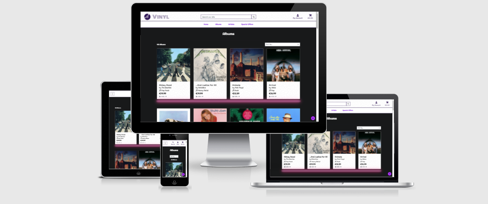
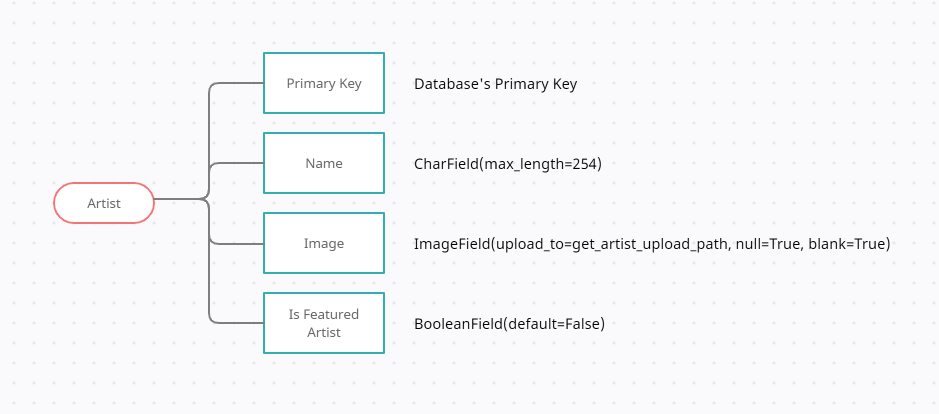
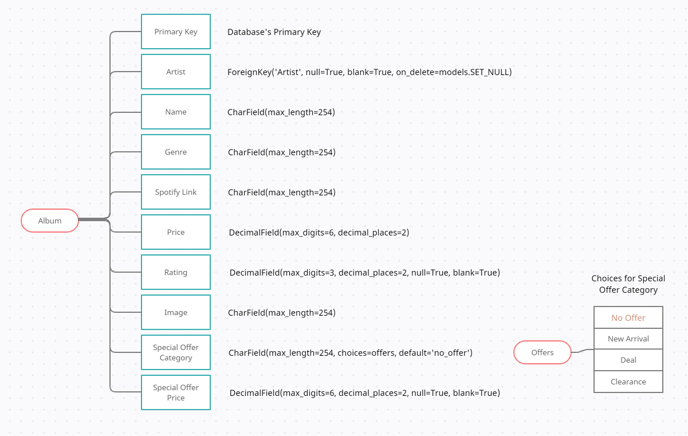
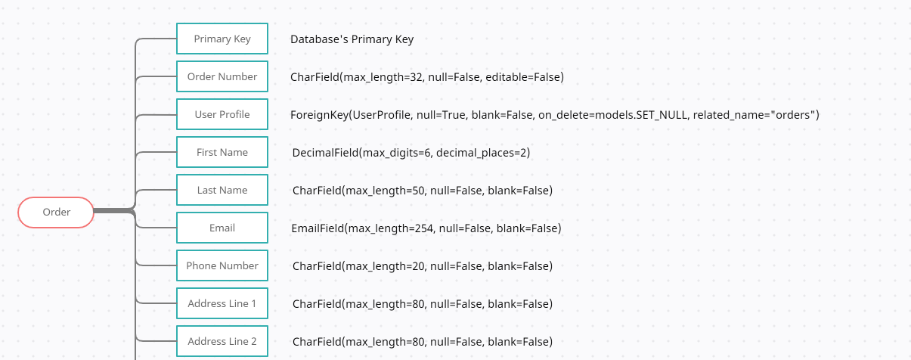
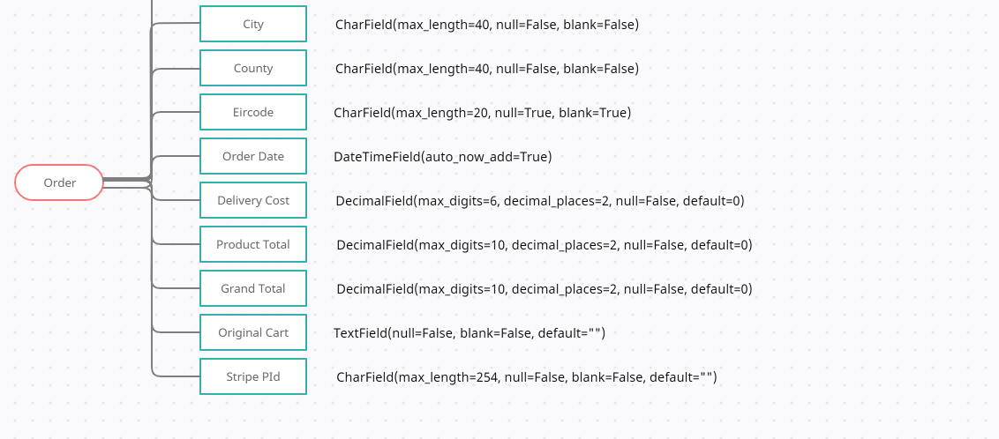
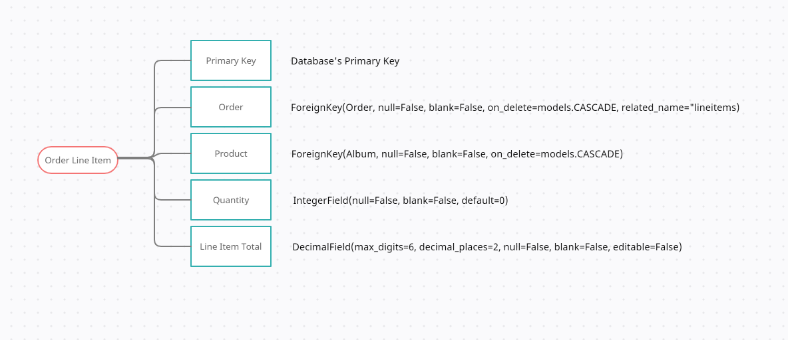
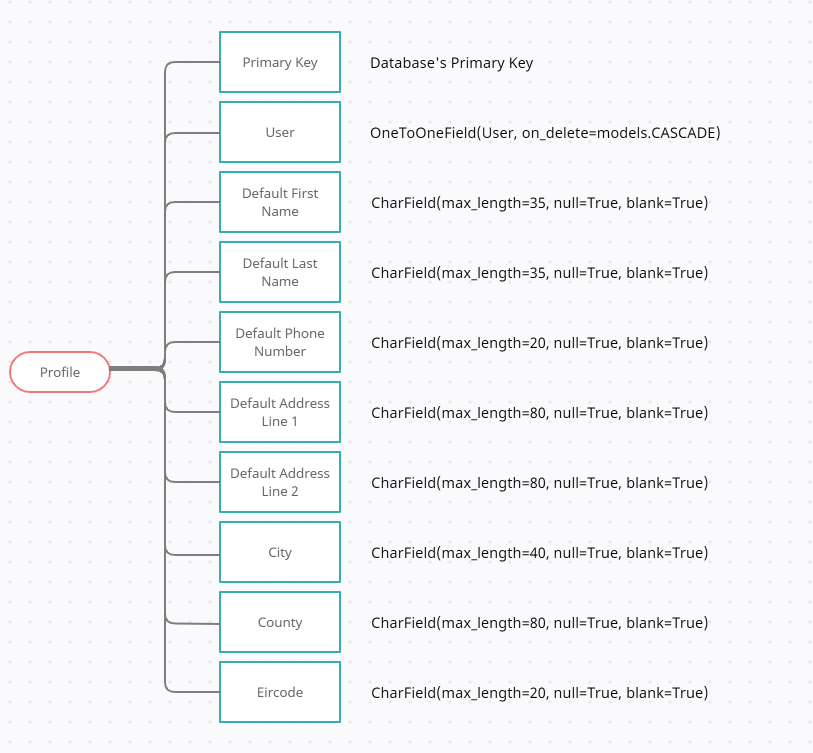

# Vinyl

## User Experience (UX)

---

-   ### User stories

    -   #### As a regular user I need to

        - Be able to register with my Spotify account or with my email and a password.
        - Be able log in with my credentials and log out.
        - Be able to recover my password in case I lose it.
        - Be able to change the default delivery information so it is auto filled whenever I placed an order.
        - Be able to search for artists, albums and genres so I can find the desired album.
        - Be able to order any album available in the store.
        - Be able to look at each album's details so I can make sure it has the contents I want.
        - Be able to look at an artist's page so I can get a list of their albums.
        - Be able to access my shopping cart so I can check all the items I have added before checkout.
        - Be able to adjust the quantity of items from within the shopping cart.
        - Be able to easily fill the checkout form and feel like it is a secure transaction.
        - Be able to check for a confirmation email upon successfully ordering any items.
	    - Be able to look for my order history to check past orders.

    -   #### As an admin I need to

        - Be able to do everything a regular user does after my account is created and set as superuser.
        - Be able to add artists to the catalogue.
        - Be able to modify artists in the catalogue.
        - Be able to remove artists from the catalogue.
        - Be able to add albums to the catalogue.
        - Be able to modify albums in the catalogue.
        - Be able to remove albums from the catalogue.

-   ### Design
    -   #### Colour Scheme
        The main colours used throughout the page are 
        -   #18191A For the background.
        -   #FF44CC For the neon horizontal rules and the floating action button.
        -   #FFF For the nav menu and texts on dark background.
        -   #B026FF For the nav menu text.
        -   #2e1155 For the topnav logo, text and icon colour.

        The following colour palette was chosen as the inspiration for the base colours picked
        

-   ### Typography
    -   Two main fonts were chosen for this page 
        -   Monoton for the logo's text with cursive as fallback, giving the logo a look that mimics a vinyl record's grooves.
        -   Righteous for the rest of the text, with cursive as fallback, granting a vintage appearance typical of pop culture posters from the vinyl golden era.

    ### Imagery
    -   The **Home Page** sections use vintage pictures of vinyl records or antique equipment in a parallax style to contrast the modernity of the webpage with the technology of past decades.
    -   The album covers are presented in their flagship square design to simulate the feeling of browsing a real store. 
    -   The artist banners were introduced to add personality to the page and to show the great talents behind the products being sold.
    -   The logo was chosen as a simple vinyl vector to show simpleness and to accentuate the real product of the business.
    -   Neon horizontal rules where used under albums to imitate shelves lighted by the urbanity of the vinyl era.
    -   The text adornment around the introduction in the **Home Page** was used to depict the less reductive design of the past.

-   ### Wireframes
   
    You can access the wireframes document by clicking [Here](https://github.com/JuanBrachoDev/Vinyl/tree/master/docs/readme/WIREFRAMES.md).

## Database

---

-   ### General Schema
   

-   ### Artist Schema
   

-   ### Album Schema
   

-   ### Order Schema
   
   

-   ### Order Line Item Schema
   

-   ### User Profile Schema
   

## Features

---

-  ### Responsiveness
    Website has been built to work in a wide range of screen sizes.

-  ### Nav Bar
    Allows users to navigate each page of the website efficiently.

-  ### Search Bar
    Let’s users filter albums by name, artist name and genre.

-  ### Home Page
    Introduces the user to the website, a dynamic sample of different special offers, and shows all albums at the end.

-  ### Albums
    Shows all available albums to the user, including sorting and filtering methods.

-  ### Artists
    Shows all related artists including sorting and filtering methods.

-  ### Album Details
    Gives users the ability to add the selected album to the cart and listen to the album through a Spotify snippet.

-  ### Artist Details
    Displays the artist banner and lists all albums under the same artist.

-  ### Cart
    Shows all added items and allows the user to modify its quantities or remove them.

-  ### Checkout
    Enables order creation and payment processing, while offering to save delivery info to registered users.

-  ### Profile
    Allows users to check and change their default delivery information and view their order history.

-  ### Toasts
    Informs users of actions and events in a tidy manner.

-  ### Account
    Grants all [Django-Allauth](https://django-allauth.readthedocs.io/en/latest/index.html) functionality like registration, log in, forgotten password, email verification, etc. Includes the ability to registerlog in with Spotify accounts.

-  ### Back to Top
    Shows a floating action button in pages where albums andor artists are listed.

## Future Features

---

-   ### Footer: 
    A footer with contact info and links to social media for users to be able to contact and interact with the shop easily.
-   ### Other Products:
    More types of products are planned, including artist-related merchandise and hardware like turntables and gramophones.
-   ### Ratings System:
    The ability to rate products when bought will help other users pick and better decide if a product fits their needs.
    

## Technologies Used

---

### Languages Used

-   [HTML5](https://en.wikipedia.org/wiki/HTML5)
-   [CSS3](https://en.wikipedia.org/wiki/Cascading_Style_Sheets)
-   [JavaScript](https://en.wikipedia.org/wiki/JavaScript)
-   [Python](https://en.wikipedia.org/wiki/Python_(programming_language))
-   [Django Template Language](https://docs.djangoproject.com/en/3.2/ref/templates/language/)

### Frameworks, Libraries & Programs Used

1. [Django](https://en.wikipedia.org/wiki/Django_(web_framework))
    - Full Stack framework used to build the project.
1. [Django-Allauth](https://django-allauth.readthedocs.io/en/latest/index.html)
    - Django app that allows for both local and social authentication.
1. [Black](https://black.readthedocs.io/en/stable/index.html)
    - Code formatter used for python files.
1. [W3 Validator](https://validator.w3.org)
    - Used to validate HTML and CSS files.
1. [JS Hint](https://jshint.com)
    - Used to validate JS files.
1. [Chrome DevTools](https://developer.chrome.com/docs/devtools/)
    - Chrome's DevTools were used throughout the project to test the layout and make the necessary adjustments.
1. [Google Fonts](https://fonts.google.com)
    - Google fonts were used to import the 'Monoton' and 'Righteous' fonts.
1. [Font Awesome](https://fontawesome.com)
    - Font Awesome was used to add icons like the ones used in the add remove buttons, and the tutorial floating action button.
1. [jQuery](https://jquery.com)
    - jQuery was used to enhance JavaScript code, providing useful methods and selectors to it.
1. [Git](https://git-scm.com)
    - Git was used for version control by utilizing the Gitpod terminal to commit to Git and Push to GitHub.
1. [GitHub](https://github.com)
    - GitHub is used to store the project's code after being pushed from Git.
1. [Django-Secret-Key-Generator](https://miniwebtool.com/django-secret-key-generator/)
    - Used to generate the secret key for Django.
1. [Amazon Web Services](https://aws.amazon.com)
    - Used to store static and media files.
1. [Heroku Postgres](https://www.heroku.com/postgres)
    - SQL Database service provided by Heroku.
1. [Heroku](https://www.heroku.com/home)
    - Heroku was the platform used to deploy the application from the GitHub repository
1. [Balsamiq](https://balsamiq.com)
    - Balsamiq was used to create the [wireframes](https://github.com/JuanBrachoDev/Vinyl/tree/master/docs/readme/WIREFRAMES.md) during the design process.
1. [Creately](https://app.creately.com)
    - Editor used to create schema images for readme file.
1. [Am I responsive](http://ami.responsivedesign.is/)
    - Used to efficiently test different responsive layouts and provide the header image in the readme file.
1. [Dillinger](http://dillinger.io)
    - Markdown editor used to create the readme file.

## Testing

---
You can access the testing document by clicking [Here](https://github.com/JuanBrachoDev/Vinyl/tree/master/docs/readme/TESTING.md).

## Deployment

---

### Deployment to Heroku

The project was deployed to [Heroku](https://www.heroku.com/home) by automatically deploying from [GitHub](https://github.com) using the following steps

 This guide assumes you already have a [GitHub](https://github.com) repo that contains an ``env.py`` file that stores your environment's custom settings.

1. Install Gunicorn to use as web server

            $ pip3 install gunicorn
1. Set up the ``requirements.txt`` and ``Procfile`` by using the following commands in the terminal

            $ pip3 freeze --local  requirements.txt
            $ echo web gunicorn your_django_app_name.wsgiapplication  Procfile
1. Push the code to [GitHub](https://github.com) so the repo contains these newly added files.
1. Log in to [Heroku](https://www.heroku.com/home), (or Register if needed).

- ##### Heroku App
    1. Click on New in the dashboard and select Create new app.
    1. Enter App name and select the region closest to you, (Europe was selected for this project).
    1. Within the app dashboard select the Deploy menu and click on the Connect to GitHub button.
    1. Search for the desired repo within your [GitHub](https://github.com) profile and click Connect.
    1. Click on Settings in the app dashboard and select Reveal Config Vars.
    1. Input all environment variables found in your ``env.py`` file.
    2. It is recommended to create a new Django secret key for each project, this can be done [here](https://miniwebtool.com/django-secret-key-generator). Add it as a config variable in [Heroku](https://www.heroku.com/home), and then add this to your ``settings.py`` file
    
            SECRET_KEY = os.environ.get('SECRET_KEY', '')
    1. Add your [Heroku](https://www.heroku.com/home) app to the allowed hosts in your ``settings.py`` file like so

            ALLOWED_HOSTS = ['your_heroku_app_name.herokuapp.com', 'localhost']
    1. Disable static files collection by adding DISABLE_COLLECTSTATIC to your config variables in your [Heroku](https://www.heroku.com/home) app and giving it the value of one (1). This should be left untouched until [AWS](https://aws.amazon.com) is set up.
    1. Go back to the Deploy tab and select Enable Automatic Deploys.
    1. Below the automatic deployment section select the master branch and click on Deploy Branch.
    1. Wait for [Heroku](https://www.heroku.com/home) to finish the deployment and finally click on View to access the deployed app.

- ##### Database
    1. Within the [Heroku](https://www.heroku.com/home) app go to the resources tab and in the addons section look for Heroku Postgres and select your plan, (for this project the Free plan was selected).
    1. Back in your IDE install the following packages and then freeze the requirements

            $ pip3 install dj-database-url
            $ pip3 install psycopg2-binary
            $ pip3 freeze --local  requirements.txt
    1. In your ``settings.py`` file import dj_database_url
    
            import dj_database_url
    1. And then comment out your current ``DATABASES`` settings and use these instead, the Postgres URL can be found in the environment variables [Heroku](https://www.heroku.com/home). 

            DATABASES = {
                'default' dj_database_url.parse(your-postgres-url)
            }
    1. Don't push your code just yet as you shouldn't expose your Postgres URL in version control.
    1. Run migrations.
    1. At this point you are free to start to populate the database by manually entering data, using fixtures, etc. A superuser should be created as well.
    1. After that is done you should delete your Postgres URL from the settings and replace it with a call to the environment variable like so

            DATABASES = {
                'default' dj_database_url.parse(os.environ.get('DATABASE_URL'))
            }
    1. Now you are safe to push your code and use this database.

### Amazon Web Services (AWS)
AWS were used to store and serve both static and media files using the following steps

- ##### Create an [AWS](https://aws.amazon.com) account or log in into your existing one.
- ##### Bucket
    1. Search for the S3 service and create a new bucket, selecting a name, the closest region to you, untick Block all public access, and acknowledge that the bucket will be public.
    1. On the properties tab look for Static website hosting and enable it, add some default values to the index and error documents and save the changes.
    1. On the permissions tab look for Cross-origin resource sharing (CORS) and enter the following configuration 
     
                [
                  {
                      AllowedHeaders [
                          Authorization
                      ],
                      AllowedMethods [
                          GET
                      ],
                      AllowedOrigins [
                          
                      ],
                      ExposeHeaders []
                  }
                ]
    1. Next look for Bucket policy and select the policy generator, for the policy type select S3 Bucket Policy, allow all principals by typing in , select the GetObject, PutObject, DeleteObject actions and finally copy the ARN from the policy tab and paste it in the ARN field. Copy the resulting policy and paste it in the policy tab. Before saving add a /\* at the end of the ARN to allow access to all resources in the bucket. 
    1. Back in the permissions tab look for Access control list (ACL) and set the list and read objects permissions for everyone under the Public Access section and save your changes.

- ##### User
    1. Search for the IAM service and create a new group and give it name of your choice, then click next until the group is created
    1. Then in the Policies tab select Create Policy, select Import managed policy and import AmazonS3FullAccess, then go back to the bucket and copy the ARN, and in the JSON editor of the IAM policy replace the value of Resource with

            Resource [
                your_arn_name,
                your_arn_name
            ]
           
    1. After that click on next until you get to Review Policy and enter a name and description of your choice and click on Create Policy.
    1. On the Users tab click on Add User, enter a name and tick Access key - Programmatic access. Click Next and select the group previously created, then click next until the User is created. Before closing make sure to save the .csv file as it contains the credentials needed to connect AWS to your app.
- ##### Connecting to Django
    1. Back in your IDE you need to install two packages

            $ pip3 install boto3
            $ pip3 install django-storages
    1. Then add these to your requirements

            $ pip3 freeze --local  requirements.txt
    1. Then we should add storages to the installed apps list in ``settings.py`` and add the following settings so the app uses AWS if USE_AWS is set to True as an environment variable

            if 'USE_AWS' in os.environ
                # Cache control
                AWS_S3_OBJECT_PARAMETERS = {
                    'Expires' 'Thu, 31 Dec 2099 200000 GMT',
                    'CacheControl' 'max-age=94608000',
                }
            
                # Bucket Config
                AWS_STORAGE_BUCKET_NAME = 'bucket name'
                AWS_S3_REGION_NAME = 'your region'
                AWS_ACCESS_KEY_ID = os.environ.get('AWS_ACCESS_KEY_ID')
                AWS_SECRET_ACCESS_KEY = os.environ.get('AWS_SECRET_ACCESS_KEY')
                AWS_S3_CUSTOM_DOMAIN = f'{AWS_STORAGE_BUCKET_NAME}.s3.amazonaws.com'
            
                # Static and media files
                STATICFILES_STORAGE = 'custom_storages.StaticStorage'
                STATICFILES_LOCATION = 'static'
                DEFAULT_FILE_STORAGE = 'custom_storages.MediaStorage'
                MEDIAFILES_LOCATION = 'media'
            
                # Override static and media URLs in production
                STATIC_URL = f'https{AWS_S3_CUSTOM_DOMAIN}{STATICFILES_LOCATION}'
                MEDIA_URL = f'https{AWS_S3_CUSTOM_DOMAIN}{MEDIAFILES_LOCATION}'
    1. Then to signal Django that you would like to store and upload your static and media files to S3 you need to create a ``custom_storages.py`` file like so
    
            from django.conf import settings
            from storages.backends.s3boto3 import S3Boto3Storage
            
            
            class StaticStorage(S3Boto3Storage)
                location = settings.STATICFILES_LOCATION

            class MediaStorage(S3Boto3Storage)
                location = settings.MEDIAFILES_LOCATION

    1. After that you are ready to push your code to [Heroku](https://www.heroku.com/home) as it should run collectstatic upon deployment and your static and media files will be uploaded to S3.
    
    
## Credits

---

### Code

-   [Boutique Ado](https://github.com/Code-Institute-Solutions/boutique_ado_v1) As a base for the layout and functionality.
-   [Markdown Guide](https://www.markdownguide.org) As a guide to create the readme file.
-   [Code Institute](https://codeinstitute.net) As a general point of reference.
-   [Stack Overflow](https://stackoverflow.com) As a general point of reference.
-   [W3Schools](https://www.w3schools.com) As a general point of reference.

### Content

-   [Spotify](https://www.spotify.com) As a reference for concept.

### Media

-  Top Nav and AlbumAritst cards backgrounds Made by Tomislava Babić. Available in [Toptal](https://www.toptal.com/designers/subtlepatterns/memphis-mini-pattern).
-  Home Page text ornament Available in [Pinclipart](https://www.pinclipart.com/maxpin/oohoRi/).
-  Latest Deals parallax background By Lopsan. Available in [Pexels](https://www.pexels.com/photo/makin-magic-album-sleeve-2191013).
-  New Arrivals parallax background By Matthias Groeneveld. Available in [Pexels](https://www.pexels.com/photo/set-of-retro-vinyl-records-on-table-4200745).
-  Clearance parallax background By Inga Seliverstova. Available in [Pexels](https://www.pexels.com/photo/black-corded-headphones-3413462).
-  Featured Artist parallax background By Elviss Railijs Bitāns. Available in [Pexels](https://www.pexels.com/photo/blue-vinyl-record-playing-on-turntable-1389429).
- Album and Artist Banners Provided by [Google Images](https://www.google.com/imghp?hl=en) under the [Education Copyright Exception](https://www.copyrightuser.org/understand/exceptions/education).
-  Logo and Default Album andArtist “56 Pirate icons” (c) by Game-Icons.net is licensed under (CC BY 3.0), content found in [Game-icons.net](https://game-icons.net).
-  Spotify Logo Available in their [developer dashboard](https://developer.spotify.com/documentation/general/design-and-branding).

### Acknowledgements

-   Friends and family continuously giving me tips and ideas for the layout.
-   Code Institute tutor support for their amazing guidance.
-   My Mentor Narender for continuous helpful feedback.

