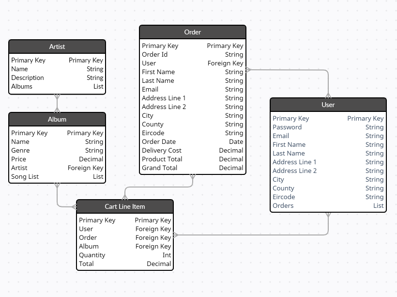

# Vinyl

## User Experience (UX)

---

-   ### User stories

    -   #### As a regular user I need to:

        - Be able to register with my google account or with my email and a password.
        - Be able log in and log out with my credentials.
        - Be able to recover my password in case I lose it.
        - Be able to change the default delivery information so it is autofilled whenever I placed an order.
        - Be able to search for artists, albums and songs so I can find the desired album.
        - Be able to order any album available in the store.
        - Be able to look at each album's details so I can make sure it has the contents I want.
        - Be able to look at an artist's page so I can get a brief description of them along with their albums.
        - Be able to access my shopping cart so I can check all items I have added before checkout.
        - Be able to adjust the quantity of items from within the shopping cart.
        - Be able to easily fill the checkout form and feel like it is a secure transaction.
        - Be able to check for a confirmation email upon successfully ordering any items.

    -   #### As an admin I need to:

        - Be able to do everything a regular user does.
        - Be able to add albums to the catalog.
        - Be able to modify albums in the catalog.
        - Be able to remove albums from the catalog.

-   ### Design
    -   

-   ### Typography
    -   

    ### Imagery
    -

*   ### Wireframes

    You can access the testing document by clicking [Here](https://github.com/JuanBrachoDev/Vinyl/tree/master/docs/readme/WIREFRAMES.md).

## Database

---

-   ### General Schema:
   

## Features

---

-  

## Future Features

---

-

## Technologies Used

---

### Languages Used

-   [HTML5](https://en.wikipedia.org/wiki/HTML5)
-   [CSS3](https://en.wikipedia.org/wiki/Cascading_Style_Sheets)
-   [JavaScript](https://en.wikipedia.org/wiki/JavaScript)
-   [Python](https://en.wikipedia.org/wiki/Python_(programming_language))

### Frameworks, Libraries & Programs Used

1. [Django](https://en.wikipedia.org/wiki/Django_(web_framework))
    - Full Stack framework used to build the project.
1. [Chrome DevTools:](https://developers.google.com/web/tools/chrome-devtools)
    - Chrome's DevTools were used throughout the project to test the layout and make the necessary adjustments.
1. [Google Fonts:](https://fonts.google.com/)
    - Google fonts were used to import the 'Berkshire Swash' and 'Merienda' fonts.
1. [Font Awesome:](https://fontawesome.com/)
    - Font Awesome was used to add icons like the ones used in the add/remove buttons, and the tutorial floating action button.
1. [jQuery:](https://jquery.com/)
    - jQuery was used to enhance JavaScript code, providing useful methods and selectors to it.
1. [Git:](https://git-scm.com/)
    - Git was used for version control by utilizing the Gitpod terminal to commit to Git and Push to GitHub.
1. [GitHub:](https://github.com/)
    - GitHub is used to store the project's code after being pushed from Git.
1. [RandomKeygen:](https://randomkeygen.com/)
    - Used to generate the secret key for the env file.
1. [Heroku:](https://www.heroku.com/home)
    - Heroku was the platform used to deploy the application from the GitHub repository
1. [Balsamiq:](https://balsamiq.com/)
    - Balsamiq was used to create the [wireframes](https://github.com/JuanBrachoDev/Vinyl/tree/master/docs/readme/WIREFRAMES.md)  during the design process.
1. [Creately:](https://app.creately.com/)
    - Editor used to create schema images for readme file.
1. [Am I responsive:](http://ami.responsivedesign.is/)
    - Used to efficiently test different responsive layouts and provide the header image in the readme file.
1. [Dillinger:](http://dillinger.io/)
    - Markdown editor used to create the readme file.

## Testing

---
You can access the testing document by clicking [Here](https://github.com/JuanBrachoDev/Vinyl/tree/master/docs/readme/TESTING.md).

## Deployment

---

### Deployment to Heroku

The project was deployed to [Heroku](https://www.heroku.com/home) by automatically deploying from [GitHub](https://github.com/) using the following steps:

> This guide assumes you already have a [GitHub](https://github.com/) repo that contains an ``env.py`` file that stores your environment's custom settings.

1. Set up the ``requirements.txt`` and ``Procfile`` by using the following commands in the terminal:

            $ pip3 freeze --local > requirements.txt
            $ echo web: python app.py > Procfile
1. Push the code to [GitHub](https://github.com/) so the repo contains these newly added files.
1. Log in to [Heroku](https://www.heroku.com/home), (or Register if needed).
1. Click on "New" in the dashboard and select "Create new app".
1. Enter "App name" and select the region closest to you, (Europe was selected for this project).
1. Within the app dashboard select the "Deploy" menu and click on the "Connect to GitHub" button.
1. Search for the desired repo within your [GitHub](https://github.com/) profile and click "Connect".
1. Click on "Settings" in the app dashboard and select "Reveal Config Vars".
1. Input all environment variables found in your ``env.py`` file.
1. Go back to the "Deploy" tab and select "Enable Automatic Deploys".
1. Below the automatic deployment section select the master branch and click on "Deploy Branch".
1. Wait for [Heroku](https://www.heroku.com/home) to finish the deployment and finally click on "View" to access the deployed app.

## Credits

---

### Code

-   [Markdown Guide](https://www.markdownguide.org/): As a guide to create the readme file.
-   [Code Institute](https://codeinstitute.net/): As a general point of reference.
-   [Stack Overflow](https://stackoverflow.com/): As a general point of reference.
-   [W3Schools](https://www.w3schools.com/): As a general point of reference.

### Content

-

### Media

-  

### Acknowledgements

-   My Mentor Narender for continuous helpful feedback.