Go back to original [document](https://github.com/JuanBrachoDev/Virtual-Parlay/tree/master/README.md).

### Validation

---

The W3C Markup Validator, W3C CSS Validator Services, JSHint, PEP8 Online and Chrome Lighthouse were used to validate and test every page and file of the project to ensure there were no errors. 

-   [W3C Markup Validator](https://validator.w3.org/#validate_by_input) 
    >   Shows duplicated id error but the elements are part of the responsive design and are never present at the same time.
    >   Shows warning hinting to remove "type" from scripts as they are unnecesary.
    >   No other errors were found.
-   [W3C CSS Validator](https://jigsaw.w3.org/css-validator/#validate_by_input)
    >   All CSS filed validated successfully.
-   [JSHint](https://jshint.com/) -
    >   Results show unused variables but ignoring those warnings as the variables are not used within the same file.
    >   No other errors were found.
-   [Black](https://black.readthedocs.io/en/stable/index.html) - [Results](https://github.com/JuanBrachoDev/Virtual-Parlay/tree/master/docs/readme/validation/python)
    >   All python code compliant with Black guidelines, which stray a bit from PEP8 recommendations. The most notable change being the [line length](https://black.readthedocs.io/en/stable/the_black_code_style/current_style.html#line-length).
-   [Google Chrome Lighthouse](https://developers.google.com/web/tools/lighthouse)
    >   Test shows performance issues and they recommend the use of different image formats like WebP or AVIF. This mainly affects pages where multiple albums or artists are rendered.
    >   Got high scores in all other categories.

### Responsiveness

---

The main tool to test all pages for responsiveness was Chrome DevTools. Personal devices were used as well.

Here is a list of all devices tested:

| Mobile | Tablet | Desktop |
| :-: | :-: | :-: |
| Moto G4 | iPad | Acer (27") - 16:9 |
| Galaxy S5/J7 | iPad Pro | MacBook Pro (15") |
| Pixel 2/2 XL | iPad Mini | |
| iPhone 5/SE | Kindle Fire | |
| iPhone 6/7/8 | | |
| iPhone 6/7/8 Plus | | |
| iPhone X | | |

### Testing User Stories from User Experience (UX) Section

---

-   #### As a user I need to:

    - Be able to register with my Spotify account or with my email and a password.
        > I can select the "Register" option from the "My Account" drop-down and click the Spotify icon or fill the form with my credentials to register.
        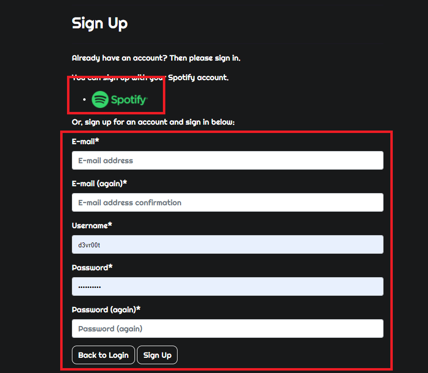

    - Be able log in with my credentials and log out.
        > I can select "Login" option from the "My Account" drop-down to sign in, and then select the "Logout" option from the "My Account" drop-down to sign out.
        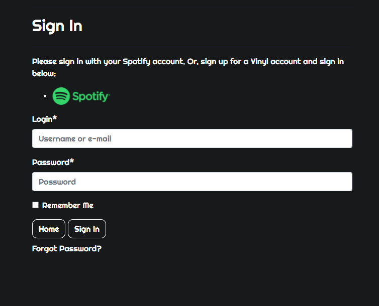
        

    - Be able to recover my password in case I lose it.
        > I can click the "Forgotten Password?" link in the Sign In page and follow the steps to recover my account.
        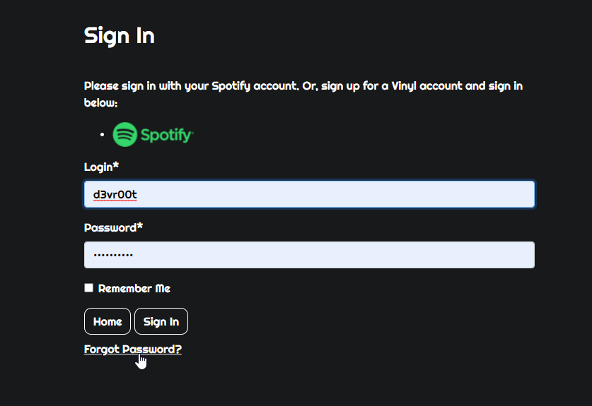

    - Be able to change the default delivery information so it is autofilled whenever I placed an order.
        > I can access my own profile by clicking the "My Account" drop-down and selecting "My Profile" where I can store my default delivery details.
        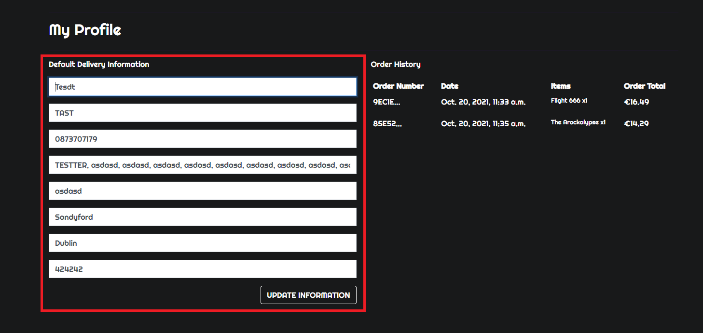

    - Be able to search for artists, albums and genres so I can find the desired album.
        > I can use the search bar located in the header to look for any album by entering album names, artist names or genres.
        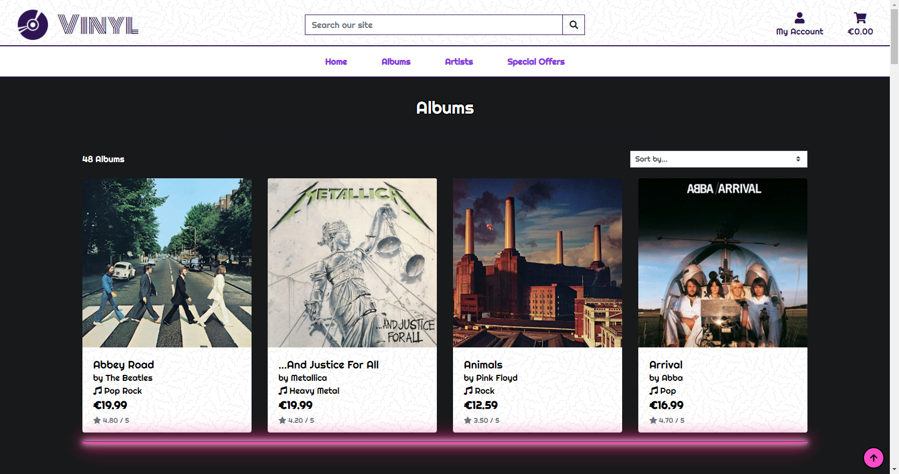
        
    - Be able to order any album available in the store.
        > I can add any album to my cart by clicking it and adding it to my cart from within the album's details.
        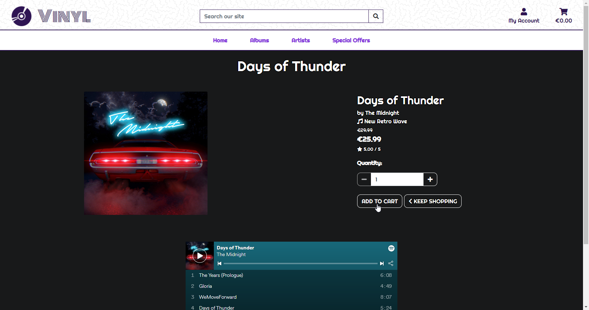
        
    - Be able to look at each album's details so I can make sure it has the contents I want.
        > I can click on any album and have a look at the album's details, including a Spotify preview so I can listen to the contents.
        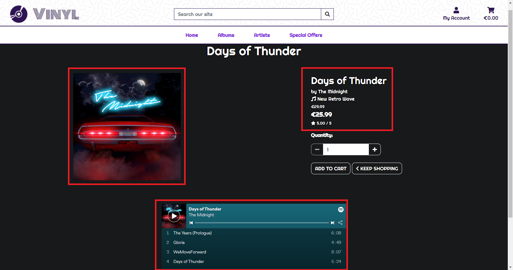
    
    - Be able to look at an artist's page so I can get a list of their albums.
        > I can click on the artist of any album or look into the artist section available from the main nav to find the one I want and then upon clicking it I am brought to the artist's page where all their albums are listed
        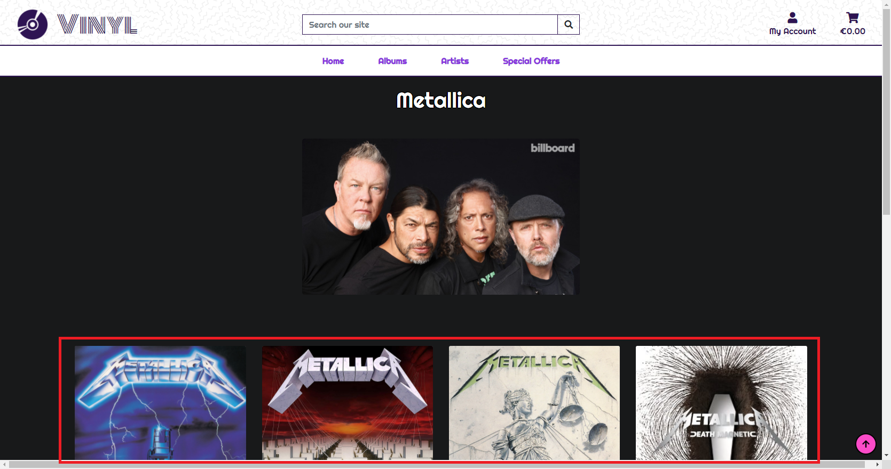
    
    - Be able to access my shopping cart so I can check all the items I have added before checkout.
        > I can click on the "Cart" button on the navbar and be brought to my shopping cart where I can find all the albums I have added so far.
        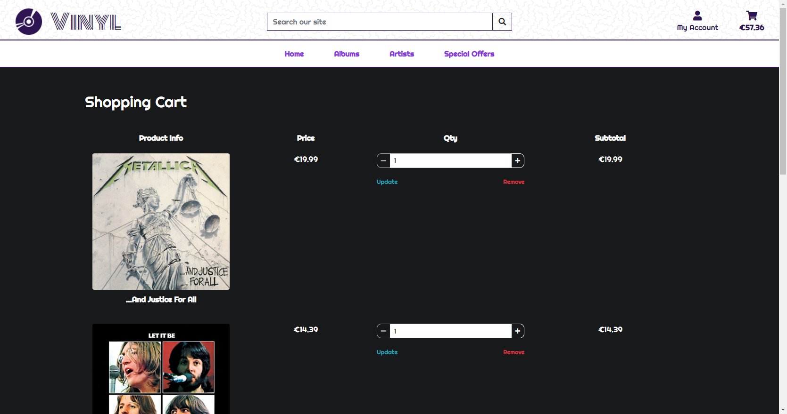
    
    - Be able to adjust the quantity of items from within the shopping cart.
        > I can use the quantity form and buttons to modify the quantity of any album I want and then clicking "Update" to save my changes or even remove them from the cart by setting the quantity to 0 or using the "Remove" button under each item.
        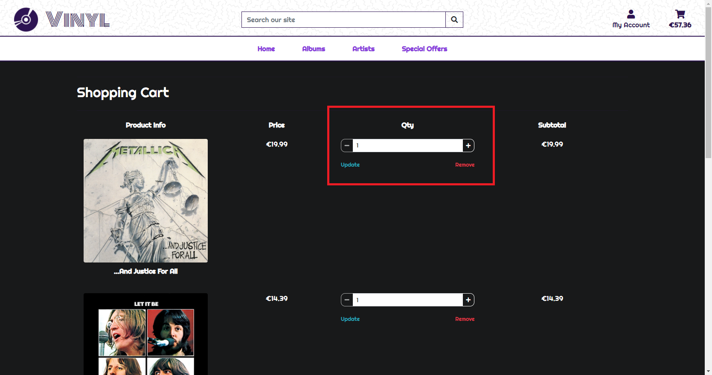
    
    - Be able to easily fill the checkout form and feel like it is a secure transaction.
        > I can click on "Secure Checkout" from the cart and be brought to a clean form where I can fill in my details and payment information and 
        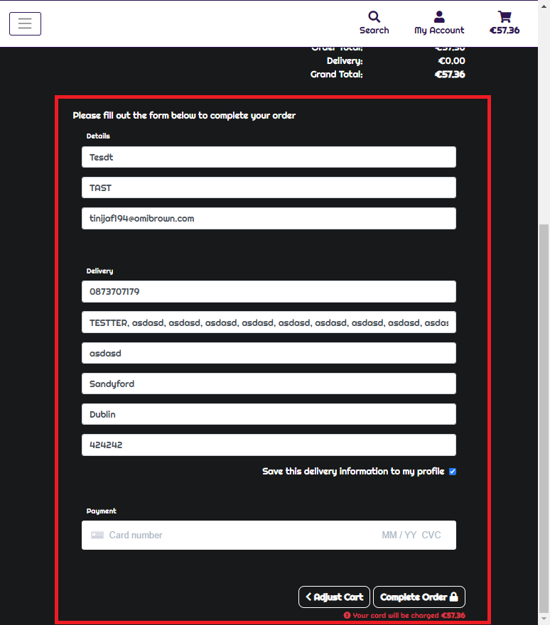
    
    - Be able to check for a confirmation email upon successfully ordering any items.
        > I can see in the order confirmation that an email was sent to my address and I can check the order details.
        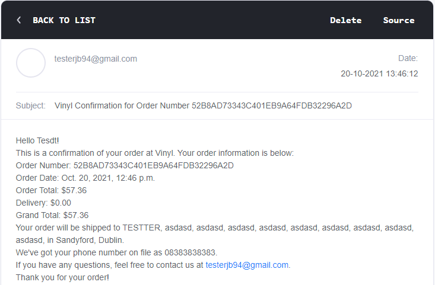
    
    - Be able to look for my order history to check past orders.
        > I can get into my profile by clicking the "My Profile" button in the "My Account" drop-down and have all my past orders listed in the order history.
        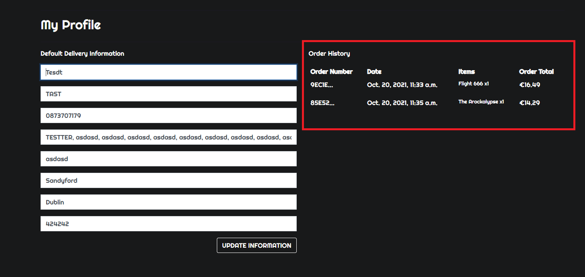
    
    
-   #### As an admin I need to:

    - Be able to do everything a regular user does after my account is created and set as superuser.
        > As a superuser I have access to anything a regular user does, I can browse for albums and artists, I can check and modify my cart, place orders, check and modify my profile, check my order history, login, logout, recover my password.

    - Be able to add artists to the catalog.
         > I can select the "Add Artist" option from the Product Management menu in the "My Account" drop-down and fill in the form to add new artists to the site.
        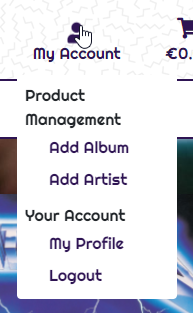
        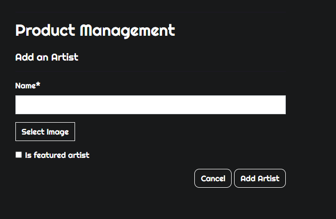
    
    - Be able to modify artists in the catalog.
        > I can select the "Edit" button in any artist card or artist detail page and fill in the form to edit an existing artist.
        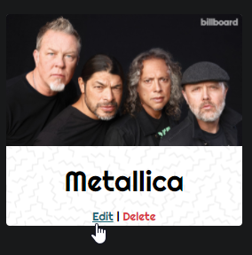
        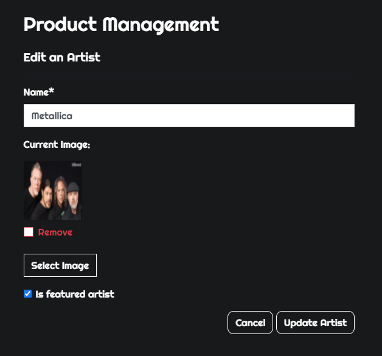
    
    - Be able to remove artists from the catalog.
        > I can select the "Delete" button in any artist card or artist detail page and fill in the form to remove an existing artist from the database.
        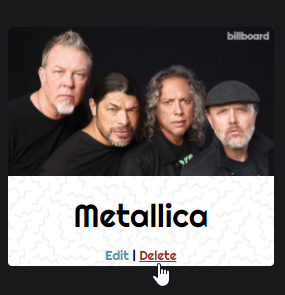
    
    - Be able to add albums to the catalog.
        > I can select the "Add Album" option from the Product Management menu in the "My Account" drop-down and fill in the form to add new albums to the site.
        
        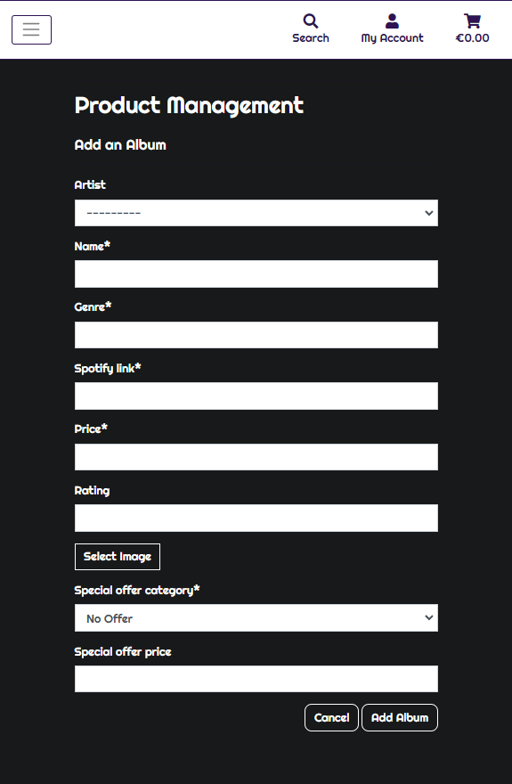
    
    - Be able to modify albums in the catalog.
        > I can select the "Edit" button in any album card or album detail page and fill in the form to edit an existing album.
        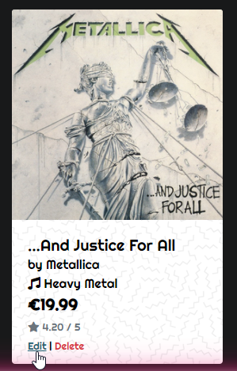
        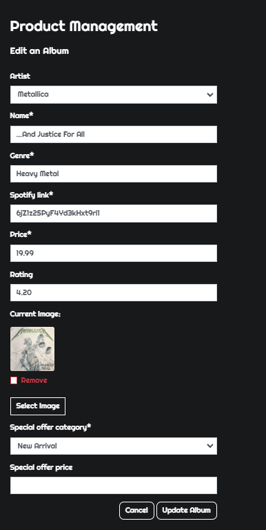
    
    - Be able to remove albums from the catalog.
        > I can select the "Delete" button in any artist card or artist detail page and fill in the form to remove an existing artist from the database.
        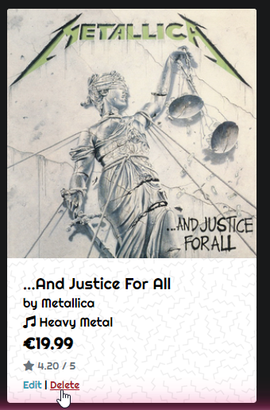
    

### Functionality Testing

---

The following features were tested for **Navbar**:

| Feature | Expected Behaviour | Testing Method | Result |
| :-: | :-: | :-: | :-: |
| Logo | Links to **Home Page** and should be hidden on medium and smaller devices. Has a mouseover animation where the record spins and the name lights up. | Clicked on logo and it links correctly, hovered mouse and animation plays successfully, is hidden on medium and smaller devices. | Passed |
| Search Bar | Filters **Albums Page** based on album name, album genre or artist name. When no criteria is entered a warning toast should be triggered and all albums rendered. When no album matches de criteria an empty albums page with a message indicating that no album was found. | Entered albums names, genres and artist names and all filtered correctly. Entered no term and the regular albums page was rendered with the warning toast shown. Entered a complex term that doesn't match any album's and an empty album page was rendered with the expected message. | Passed |
| Account Button | Should display a dropdown menu with **Register** and **Login** and link to those pages when no user is logged in. Display **My Profile** and **Logout** and link to those pages whenever a user is logged in. Additionally display **Add Album** and **Add Artist** and link to those pages whenever the user is also a superuser. Account icon should have a mouseover animation. | All pages display and link correctly depending on the type of user currently logged. Mouseover animation plays successfully. | Passed |
| Cart Button | Should link to the **Cart** page. Should dynamically display the current cart total. Cart icon should have a mouseover animation. | Button links correctly. Added and removed albums to the cart and the text updated as expected. Mouseover animation plays successfully. | Passed |
| Home Link | Should link to the **Home Page**. Should have a background mouseover effect. | Clicked on link and successfully moved to **Home Page**. Mouseover animation plays successfully. | Passed |
| Albums Links | Should display a dropdown with the following options: **All Albums** which links to the regular albums page. **By Price** which links to the albums page sorted by price. **By Rating** which links to the albums page sorted by rating. **By Genre** which links to the albums page sorted by genre. **By Artist** which links to the albums page sorted by artist name. Should have a background mouseover effect. | All options link successfully, and albums page is always sorted as expected. Mouseover animation plays successfully. | Passed |
| Artists Links |  Should display a dropdown with the following options: **All Artists** which links to the regular artists page. **Featured Artists** which filters the artists page to only show featured artists. Should have a background mouseover effect. | All options link successfully, and artist page is always filtered as expected. Mouseover animation plays successfully. | Passed |
| Special Offers Links | Should display a dropdown with the following options: **Deals** which links to the albums page filtered to only show deals". **New Arrival** which links to the albums page filtered to only show new arrivals. **Clearance** which links to the albums page filtered to only show clearance offers. **All Specials** which links to the albums page filtered to show all albums with any type of special offer. Should have a background mouseover effect. | All options link successfully, and albums page is always filtered as expected. Mouseover animation plays successfully. | Passed |

The following features were tested for **Mobile Navbar**:

| Feature | Expected Behaviour | Testing Method | Result |
| :-: | :-: | :-: | :-: |
| Burger Menu Button | Should only show itself on medium and smaller devices. When clicked it should trigger the drop-down menu with the nav links. | The button doesn't show in large devices as expected and it successfully triggers the nav menu drop-down. | Passed |
| Search Bar | Filters **Albums Page** based on album name, album genre or artist name. When no criteria is entered a warning toast should be triggered and all albums rendered. When no album matches de criteria an empty albums page with a message indicating that no album was found. Search button should trigger a dropdown with the search bar. | Entered albums names, genres and artist names and all filtered correctly. Entered no term and the regular albums page was rendered with the warning toast shown. Entered a complex term that doesn't match any album's and an empty album page was rendered with the expected message. | Passed |
| Account Button | Should display a dropdown menu with **Register** and **Login** and link to those pages when no user is logged in. Display **My Profile** and **Logout** and link to those pages whenever a user is logged in. Additionally display **Add Album** and **Add Artist** and link to those pages whenever the user is also a superuser. The dropdown trigger button's text should change from "My Account" to "User" on the smallest screens. Account icon should have a mouseover animation. | All pages display and link correctly depending on the type of user currently logged. Text changes as expected on the smallest screens. Mouseover animation plays successfully. | Passed |
| Cart Button | Should link to the **Cart** page. Should dynamically display the current cart total. Cart icon should have a mouseover animation. | Button links correctly. Added and removed albums to the cart and the text updated as expected. Mouseover animation plays successfully. | Passed |
| Home Link | Should link to the **Home Page**. | Clicked on link and successfully moved to **Home Page**. | Passed |
| Albums Links | Should display a dropdown with the following options: **All Albums** which links to the regular albums page. **By Price** which links to the albums page sorted by price. **By Rating** which links to the albums page sorted by rating. **By Genre** which links to the albums page sorted by genre. **By Artist** which links to the albums page sorted by artist name. | All options link successfully, and albums page is always sorted as expected. | Passed |
| Artists Links | Should display a dropdown with the following options: **All Artists** which links to the regular artists page. **Featured Artists** which filters the artists page to only show featured artists. | All options link successfully, and artist page is always filtered as expected. | Passed |
| Special Offers Links | Should display a dropdown with the following options: **Deals** which links to the albums page filtered to only show deals". **New Arrival** which links to the albums page filtered to only show new arrivals. **Clearance** which links to the albums page filtered to only show clearance offers. **All Specials** which links to the albums page filtered to show all albums with any type of special offer. | All options link successfully, and albums page is always filtered as expected. | Passed |

The following features were tested for **Home Page**:

| Feature | Expected Behaviour | Testing Method | Result |
| :-: | :-: | :-: | :-: |
| Who are we? Section | Shows text between two text ornaments. | Displays successfully on all screen sizes. | Passed |
| Latest Deals Section Links | Album cover and name should link to the **Album Detail**. Artist name should link to the **Artist Detail** page if it exists, otherwise show "Independent Artist" that doesn't link to any page. Genre should link to the **Albums** page filtered by genre. Should only show a maximum of 4 randomized albums with the "Deal" special offer. | All links function correctly. Artist name shows "Independent Artist" as expected. Consistently shows a randomized sample of 4 albums properly filtered. | Passed |
| New Arrivals Section Links | Album cover and name should link to the **Album Detail**. Artist name should link to the **Artist Detail** page if it exists, otherwise show "Independent Artist" that doesn't link to any page. Genre should link to the **Albums** page filtered by genre. Should only show a maximum of 2 randomized albums with the "New Arrivals" special offer. | All links function correctly. Artist name shows "Independent Artist" as expected. Consistently shows a randomized sample of 2 albums properly filtered. | Passed |
| Clerance Section Links | Album cover and name should link to the **Album Detail**. Artist name should link to the **Artist Detail** page if it exists, otherwise show "Independent Artist" that doesn't link to any page. Genre should link to the **Albums** page filtered by genre. Should only show a maximum of 2 randomized albums with the "Clearance" special offer. | All links function correctly. Artist name shows "Independent Artist" as expected. Consistently shows a randomized sample of 2 albums properly filtered. | Passed |
| Featured Artist Section Links | Shows a single featured artist on top. The artist image and name should link to the **Artist Detail** page. Album cover and name should link to the **Album Detail**. Artist name should link to the **Artist Detail** page if it exists, otherwise show "Independent Artist" that doesn't link to any page. Genre should link to the **Albums** page filtered by genre. Should only show a maximum of 4 randomized albums under the same featured artist. | All links function correctly. Artist name shows "Independent Artist" as expected. Consistently shows a randomized sample of 4 albums properly filtered. | Passed |
| All Albums Section Links | Album cover and name should link to the **Album Detail**. Artist name should link to the **Artist Detail** page if it exists, otherwise show "Independent Artist" that doesn't link to any page. Genre should link to the **Albums** page filtered by genre. Should show all available albums. | All links function correctly. Artist name shows "Independent Artist" as expected. Shows all albums successfully. | Passed |
| Neon Horizontal Rules | Horizontal rules should appear below rows of albums with no consecutive horizontal rules appearing without any albums between them. | Horizontal rules show as expected. | Passed |
| Back to Top Button | Button should stay on the bottom right of the screen regardless of scrolling. Clicking the button should bring the user back to the top of the page. | Button stays fixed in the bottom right corner of the screen and works as expected when clicked. | Passed |
| Admin Buttons | **Edit** and **Delete** buttons should show for superadmins only on the featured artist and all albums of the **Home** page. Edit button should link to the **Edit Album** or **Edit Artist** page accordingly. Delete button should delete the chosen album or artist. | Tested buttons across all section and all worked as expected. | Passed |

The following features were tested for **Albums Page**:

| Feature | Expected Behaviour | Testing Method | Result |
| :-: | :-: | :-: | :-: |
| Sorting Section | The current sorting text should tell the user the amount of albums found for the current query and offer a link back to albums home if any sorting other than the default is in place. The sorting box should show the sorted album page once the desired method is selected. | The text functions as expected. Clicked on all sorting methods with and without different filterings and the albums were successfully sorted. | Passed |
| Album Links | Album cover and name should link to the **Album Detail**. Artist name should link to the **Artist Detail** page if it exists, otherwise show "Independent Artist" that doesn't link to any page. Genre should link to the **Albums** page filtered by genre. Should show all available albums. | All links function correctly. Artist name shows "Independent Artist" as expected. | Passed |
| Neon Horizontal Rules | Horizontal rules should appear below rows of albums with no consecutive horizontal rules appearing without any albums between them. | Horizontal rules show as expected. | Passed |
| Back to Top Button | Button should stay on the bottom right of the screen regardless of scrolling. Clicking the button should bring the user back to the top of the page. | Button stays fixed in the bottom right corner of the screen and works as expected when clicked. | Passed |
| Admin Buttons | **Edit** and **Delete** buttons should show for superadmins only on all albums of the **Albums** page. Edit button should link to the **Edit Album**. Delete button should delete the chosen album. | Tested buttons on different albums and all worked as expected. | Passed |

The following features were tested for **Artists Page**:

| Feature | Expected Behaviour | Testing Method | Result |
| :-: | :-: | :-: | :-: |
| Sorting Section | The current sorting text should tell the user the amount of artists found for the current query and offer a link back to artists home if any sorting other than the default is in place. The sorting box should show the sorted and/or filtered artist page once the desired method is selected. | The text functions as expected. Clicked on all sorting methods with and without filtering and the artists were successfully sorted. | Passed |
| Artist Links | Artist image and name should link to the respective **Artist Detail** page. | Tested different links and all functioned correctly. | Passed |
| Horizontal Rules | Horizontal rules should appear below rows of artists with no consecutive horizontal rules appearing without any albums between them. | Horizontal rules show as expected. | Passed |
| Back to Top Button | Button should stay on the bottom right of the screen regardless of scrolling. Clicking the button should bring the user back to the top of the page. | Button stays fixed in the bottom right corner of the screen and works as expected when clicked. | Passed |
| Admin Buttons | **Edit** and **Delete** buttons should show for superadmins only on all artists of the **Artists** page. Edit button should link to the **Edit Artist**. Delete button should delete the chosen artist. | Tested buttons on different artists and all worked as expected. | Passed |

The following features were tested for **Album Details Page**:

| Feature | Expected Behaviour | Testing Method | Result |
| :-: | :-: | :-: | :-: |
| Album Cover | Clicking the album cover should open the image on another tab. If the album has no cover the default image shouldn't open in a new tab. | Tested different albums and all opened their images in another tab unless they had the default image. | Passed |
| Album Links | Artist name should link to the **Artist Detail** page if it exists, otherwise show "Independent Artist" that doesn't link to any page. Genre should link to the **Albums** page filtered by genre. | All links function correctly. Artist name shows "Independent Artist" as expected. | Passed |
| Cart Links | Quantity input shouldn't allow integers < 1 and > 99. The "-" quantity button should disable itself if quantity is at 0. The "+" quantity button should disable itself if quantity is at 99. The "Add to Cart" button should add the selected quantity of the album to the cart, if an invalid quantity value is entered like white space then it redirects to 404. The "Keep Shopping" button should redirect the user back to the **Albums** page. | Tried to input strings, negative numbers, decimal numbers and all failed validation. White space in quantity results in 404 as expected. Quantity buttons also disabled themselves and worked correctly as expected. "Keep Shopping" button also links correctly. | Passed |
| Spotify Player | Should show the Spotify player whenever a valid request is made or show a message informing the user that the album lacks its Spotify counterpart. | The player shows and works as expected. | Passed |
| Admin Buttons | **Edit** and **Delete** buttons should show for superadmins only on all albums of the **Album Detail** page. Edit button should link to the **Edit Album**. Delete button should delete the chosen album. | Tested buttons on different albums and all worked as expected. | Passed |

The following features were tested for **Artist Details Page**:

| Feature | Expected Behaviour | Testing Method | Result |
| :-: | :-: | :-: | :-: |
| Artist Banner | Clicking the artist banner should open the image on another tab. If the artist has no banner the default image shouldn't open in a new tab. | Tested different artists and all opened their images in another tab unless they had the default image. | Passed |
| Album Links | Album cover and name should link to the **Album Detail**. Artist name should link to the **Artist Detail** page if it exists, otherwise show "Independent Artist" that doesn't link to any page. Genre should link to the **Albums** page filtered by genre. Should only show albums related to the artist. | All links function correctly. Artist name shows "Independent Artist" as expected. No albums unrelated to the artist were shown. | Passed |
| Neon Horizontal Rules | Horizontal rules should appear below rows of albums with no consecutive horizontal rules appearing without any albums between them. | Horizontal rules show as expected. | Passed |
| Back to Top Button | Button should stay on the bottom right of the screen regardless of scrolling. Clicking the button should bring the user back to the top of the page. | Button stays fixed in the bottom right corner of the screen and works as expected when clicked. | Passed |
| Admin Buttons | **Edit** and **Delete** buttons should show for superadmins only on the artist and all albums of the **Artist Detail** page. Edit button should link to the **Edit Album** or **Edit Artist** page accordingly. Delete button should delete the chosen album or the artist. | Tested buttons across all section and all worked as expected. | Passed |

The following features were tested for **Profile Page**:

| Feature | Expected Behaviour | Testing Method | Result |
| :-: | :-: | :-: | :-: |
| Delivery Details Form | Each field should load the default value stored or none if it doesn't exist. Upon submitting the form all values are to be stored in the database. | Values are preloaded as expected and are successfully saved upon submission. | Passed |
| Order History Links | Should show all orders associated to the user. The order number should link to the respective **Checkout Success* page.  | Order history shows as expected and order links function correctly. | Passed |

The following features were tested for **Cart Page**:

| Feature | Expected Behaviour | Testing Method | Result |
| :-: | :-: | :-: | :-: |
| Item Quantity Section | Quantity input shouldn't allow integers < 1 and > 99. The "-" quantity button should disable itself if quantity is at 0. The "+" quantity button should disable itself if quantity is at 99. The "Update" button should update the selected quantity of the album to the cart and remove it if the quantity falls below 1, if an invalid quantity value is entered like white space or decimal numbers then it redirects to 404. The "Remove" button should remove the selected item from the cart. | Tried to input strings it failed validation. White space in quantity results in 404 as expected. If negative number or 0 is intered the item is removed. Quantity buttons also disabled themselves and worked correctly as expected. | Passed |
| Order Total Section | The cart total should show the sum of all subtotal for each item, the delivery fee should show the fee or 0 if the delivery threshold has been met and the user should receive a warning text if the threshold hasn't been met. The grand total should show the sum of the cart total and the delivery fee. The "Keep Shopping" button should redirect the user back to the **Albums** page. The "Secure Checkout" should direct the user to the **Checkout** page. | All totals and fees function as expected. The delivery warning shows whenever the threshold hasn't been met. All buttons link correctly. | Passed |

The following features were tested for **Checkout Page**:

| Feature | Expected Behaviour | Testing Method | Result |
| :-: | :-: | :-: | :-: |
| Order Summary | Should show a concise summary of all items in the cart and the totals/delivery fee. | All values are shown correctly. | Passed |
| Delivery Information Form | Form should be auto-populated with profile values if the exist. | Fields are populated as expected. | Passed |
| Save Details Checkbox | Ticking the box should save the form info to the user profile upon form submission. Leaving unticked should do nothing. | Details are successfully saved when the box is ticked and also changed when it is left unticked. | Failed |
| Card Input | The card field should only accept valid card numbers. | Tried inputting strings, white spaces, incomplete numbers and they all failed. | Passed |
| Order Submit | An order should be created and the payment processed as long as all fields in the form have been validated. If an order is sucessfully created then redirect the user to the **Checkout Success** page. An email should be sent to the user with the order information. | Tried submitting invalid fields and the submission validated correctly. Upon a successful submission an order is created, the stripe webhook confirms the collection of payment of the test card, and the user is brought to the **Checkout Success** page. Email was received and it contained the correct information. | Passed |

The following features were tested for **Checkout Success Page**:

| Feature | Expected Behaviour | Testing Method | Result |
| :-: | :-: | :-: | :-: |
| Order Information | Should show the order summary to the user, listing all order info, items and delivery information entered. | The summary correctly displays all the information as expected. | Passed |
| Back to Deals/Back to Profile Section | The button should function as "Back to Deals" when coming from a successful purchase and link to the "Deals" page. It should show "Back to Profile" and link back to the profile when visiting from the order history. | The button shows the appropiate text and functionality in each case. | Passed |

The following features were tested for **Add Album Page**:

| Feature | Expected Behaviour | Testing Method | Result |
| :-: | :-: | :-: | :-: |
| Album Form | All fields should be properly validated before submission so only valid data is stored. Upon a successful submission the album should be added to the database and the user redirected to the newly created **Album Detail** page. | Tried different inputs to get around validation for all the fields and all failed as expected. The album is successfully added to the database upon submission and I was redirected to the newly created **Album Detail** page. | Passed |
| Not Regular-User Accessible | The URL should only be accessible by superusers. | Tried both an unregistered account and a regular user and got the warning toast informing me that only admins can access this. | Passed |

The following features were tested for **Add Artist Page**:

| Feature | Expected Behaviour | Testing Method | Result |
| :-: | :-: | :-: | :-: |
| Artist Form | All fields should be properly validated before submission so only valid data is stored. Upon a successful submission the artist should be added to the database and the user redirected to the newly created **Artist Detail** page. | Tried different inputs to get around validation for all the fields and all failed as expected. The artist is successfully added to the database upon submission and I was redirected to the newly created **Artist Detail** page. | Passed |
| Not Regular-User Accessible | The URL should only be accessible by superusers. | Tried both an unregistered account and a regular user and got the warning toast informing me that only admins can access this. | Passed |

The following features were tested for **Edit Album Page**:

| Feature | Expected Behaviour | Testing Method | Result |
| :-: | :-: | :-: | :-: |
| Album Form |  All fields should be properly validated before submission so only valid data is stored. Upon a successful submission the album should be updated to the database and the user redirected to the updated **Album Detail** page. | The album is successfully updated in the database upon submission and I was redirected to the new **Album Detail** page. | Passed |
| Not Regular-User Accessible | The URL should only be accessible by superusers. | Tried both an unregistered account and a regular user and got the warning toast informing me that only admins can access this. | Passed |

The following features were tested for **Edit Artist Page**:

| Feature | Expected Behaviour | Testing Method | Result |
| :-: | :-: | :-: | :-: |
| Artist Form | All fields should be properly validated before submission so only valid data is stored. Upon a successful submission the artist should be updated in the database and the user redirected to the new **Artist Detail** page. | Tried different inputs to get around validation for all the fields and all failed as expected. The artist is successfully updated in the database upon submission and I was redirected to the new **Artist Detail** page. | Passed |
| Not Regular-User Accessible | The URL should only be accessible by superusers. | Tried both an unregistered account and a regular user and got the warning toast informing me that only admins can access this. | Passed |

The following features were tested for **Delete Album**:

| Feature | Expected Behaviour | Testing Method | Result |
| :-: | :-: | :-: | :-: |
| Delete Functionality | By entering the correct URL or clicking the "Delete" button of the album it should be removed from the database. | The album is successfully removed from the database. | Passed |
| Not Regular-User Accessible | The URL should only be accessible by superusers. | Tried both an unregistered account and a regular user and got the warning toast informing me that only admins can access this. | Passed |

The following features were tested for **Delete Artist**:

| Feature | Expected Behaviour | Testing Method | Result |
| :-: | :-: | :-: | :-: |
| Delete Functionality | By entering the correct URL or clicking the "Delete" button of the artist it should be removed from the database. | The artist is successfully removed from the database. | Passed |
| Not Regular-User Accessible | The URL should only be accessible by superusers. | Tried both an unregistered account and a regular user and got the warning toast informing me that only admins can access this. | Passed |

The account functionality wasn't as extensively tested since there were few to no modifications apart from layout changes to the already well tested and documented [Django-Allauth](https://django-allauth.readthedocs.io/en/latest/overview.html) package which was used to handle all User accounts and authentication:

| Feature | Expected Behaviour | Testing Method | Result |
| :-: | :-: | :-: | :-: |
| Spotify Integration | Users should be able to register and log in with their Spotify accounts through the Spotify icon in the **Register** and **Sign In** pages. | Upon clicking the icon the confirmation email is received and email verification works. User is successfully added to database and is able to log in and out. | Passed |
| Sign Up Functionality | Users should be able to create a Vinyl account by filling the form in the **Register** page. | Upon filling the form the verification email is sent and upon confirming their email with the link, after confirmation has been received the user is fully registered and verified. | Passed |
| Login Functionality | Users should be able to log back into their accounts at any point. | Users are able to enter their credentials in the **Sign In** page to log back in. Link available in the "My account" drop-down. | Passed |
| Log Out Functionality | Users should be able to log out of their accounts by clicking the logout button in the My Account button. | User is logged out successfully when "Logout" button is pressed. | Passed |
| Forgotten Password Functionality | Users should be able to recover their account by clicking the "Forgotten Password?" link below the login form where they are directed to input their emails so they receive a password reset link. | Clicked the "Forgotten Password?" link and entered test credentials, received email and followed the password reset instructions and was able to log in with the new credentials after. | Passed |

### UX Testing

---

-   The Website was tested on Google Chrome, Microsoft Edge, and Mozilla Firefox browsers.
-   Friends and family members were asked to review the site and documentation to point out any errors, bugs and/or user experience issues.

### Fixed Bugs

---

-   Special offer price would not be taken into account when factoring the subtotal for the item.
       > Modified the price calculation structure and added 'if' statements to use the special offer if it was present instead of the regular price.

-   Albums with no artists would link to an inexistent page when clicking their "artist"
       > Had albums show "Independent Artist" in plain text instead of an anchor element whenever no artist is selected upon album creation/edit.

-   Spotify player in **Album Detail** page would show "bad gateway error" whenever an invalid request to the Spotify API was made.
       > Validated in the view if the response gotten from Spotify was a successful one and passed it as a boolean variable, rendering the player in the template if the request was successful and showing "Sorry, there is no spotify link available for this album." instead whenever the Spotify link was invalid.

-   Edit Post button would sometimes choose Delete when clicked or not work at all on small devices.
       > Adjusted padding and margins since it was causing selection issues along with the small space available for buttons to display.

### Known Bugs

---

-   Save information to Profile checkbox always returns True regardless of being ticked or not.
    > User's delivery details are always saved after each successful order due to the box always returning True.
